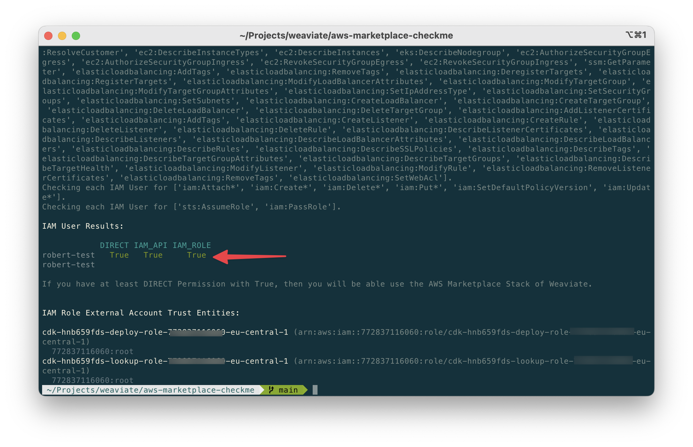

# Weaviate AWS Marketplace Permissions Check

Installing the AWS Marketplace version of Weaviate has its basis on CloudFormation.
The use of CloudFormation as well the tech-stack Weaviate requires comes with the 
need of certain permissions.

The `discover-aws-iam-resource-access.py` helps you to check if you can install the 
Weaviate Cloudformation Stack from the AWS Marketplace.

### Howto use

Please install `aws-cli` and login with your user which is being used later to install
Weaviate via AWS Marketplace.

```bash
# install aws cli via python directly
$ python -m pip install awscli

# on mac you can simply do
$ brew install awscli

# please change these according to your needs
$ aws configure
AWS Access Key ID: MYACCESSKEY
AWS Secret Access Key: MYSECRETKEY
Default region name [us-west-2]: us-west-2
Default output format [None]: json
```

Then simply execute the following things:

```bash
# install requirements
pip3 install -r requirements.txt

# execute permissions check
python3 discover-aws-iam-resource-access.py weaviate-aws-marketplace.yaml
```



## Credits 
Taken and modified from https://github.com/aws-samples/discover-aws-iam-resource-access 
